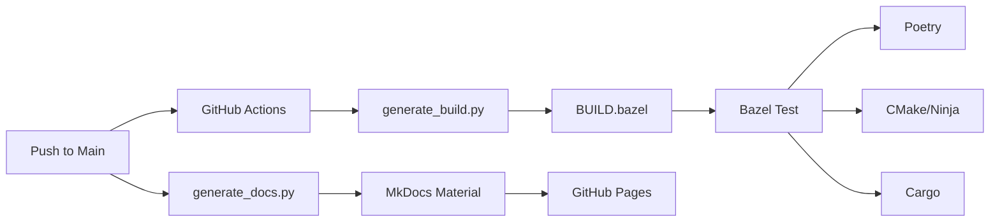
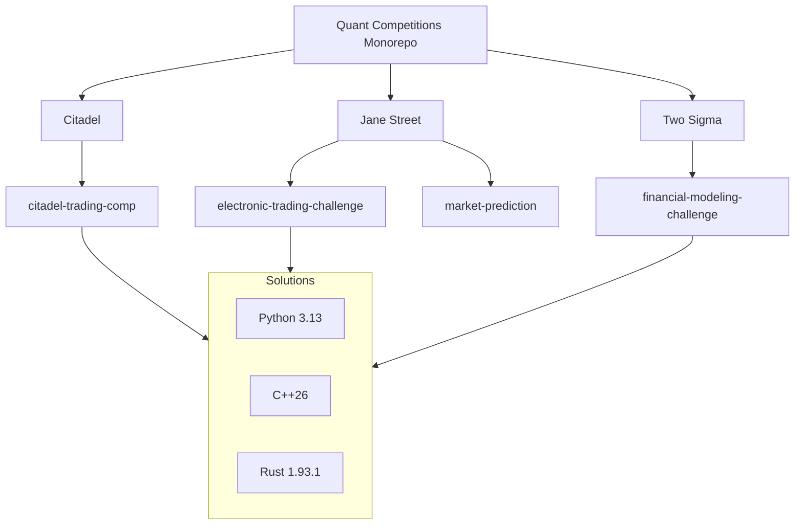

# 📉 Quant Competitions Monorepo: Production-Grade Trading Solutions

[](https://github.com/sm2774us/quant_competitions/actions/workflows/ci.yml)
[](https://sm2774us.github.io/quant_competitions/)

> **A curated collection of high-performance trading solutions for elite quantitative competitions (Citadel, Jane Street, Two Sigma, HRT).**

---

## 🏗️ Automated Build Orchestration

This monorepo features a self-discovering build and documentation pipeline.



---

This monorepo is managed using [Bazel](https://bazel.build/) and structured to facilitate cross-language development (Python 3.13, C++26, Rust 1.93.1).



---

## 🚀 Projects & Competitions

### 🏰 [Citadel](./citadel/)
- **[citadel-trading-comp](./citadel/citadel-trading-comp/)**: Triple-strat arbitrage bot (Exchange, Index, Shock).
  - *Key Algorithms:* High-frequency arbitrage, news-driven shock handling.

### 🏛️ [Jane Street](./jane_street/)
- **[electronic-trading-challenge](./jane_street/electronic_trading_challenge/)**: Electronic market maker.
- **[market-prediction](./jane_street/market_prediction/)**: Time-series forecasting for trade opportunities.
- **[trading-bot](./jane_street/trading_bot/)**: Advanced automated trading logic.

### 🧪 [Two Sigma](./two_sigma/)
- **[financial-modeling-challenge](./two_sigma/financial_modeling_challenge/)**: Predictive modeling for global markets.
- **[predicting-stock-using-news](./two_sigma/predicting_stock_using_news/)**: NLP-driven sentiment analysis for stock movement.

### :busts_in_silhouette: [MAN Group](./man/)
- **[financial-modeling-challenge](./two_sigma/financial_modeling_challenge/)**: Predictive modeling for global markets.
- **[predicting-stock-using-news](./two_sigma/predicting_stock_using_news/)**: NLP-driven sentiment analysis for stock movement.

---

## 📐 Quantitative Foundations

### ⚡ Statistical Arbitrage
The core strategies often rely on the mean-reversion property of the spread $S_t$ between two correlated assets $A$ and $B$:

$$S_t = \ln(P_{A,t}) - \beta \ln(P_{B,t})$$

where $\beta$ is the hedge ratio determined by:

$$\hat{\beta} = \frac{\text{Cov}(\ln(P_A), \ln(P_B))}{\text{Var}(\ln(P_B))}$$

### 📉 Risk-Adjusted Returns (Sharpe Ratio)
Production-grade solutions prioritize the [Sharpe Ratio](https://en.wikipedia.org/wiki/Sharpe_ratio) $\mathcal{S}$:

$$\mathcal{S} = \frac{\mathbb{E}[R_p - R_f]}{\sigma_p}$$

where $R_p$ is the portfolio return, $R_f$ is the risk-free rate, and $\sigma_p$ is the portfolio volatility.

---

## 🛠️ Build & Development

This repository uses **Bazel** for a unified build experience.

### Prerequisites
- [Bazel 7.x+](https://bazel.build/install)
- [Python 3.13+](https://www.python.org/downloads/)
- [GCC 14+ / Clang 18+](https://llvm.org/) (for C++26)
- [Rust 1.93.1+](https://www.rust-lang.org/tools/install)

### Commands
```bash
# Build all solutions
bazel build //...

# Run specific Python solution
bazel run //citadel/citadel-trading-comp/python:main -- --key=VHK3DEDE

# Run all tests
bazel test //...
```

---

## 📚 References & Further Reading
1. [Avellaneda, M., & Lee, J. H. (2010). Statistical arbitrage in the US equities market. *Quantitative Finance*.](https://www.tandfonline.com/doi/abs/10.1080/14697680802595650)
2. [Lopez de Prado, M. (2018). *Advances in Financial Machine Learning*. Wiley.](https://www.wiley.com/en-us/Advances+in+Financial+Machine+Learning-p-9781119482086)
3. [Citadel, Jane Street, & HRT Interview Preparation Wiki.](https://github.com/sm2774us/quant-wiki)

---

&copy; 2026 Quant Competitions Monorepo Team. Licensed under MIT.
