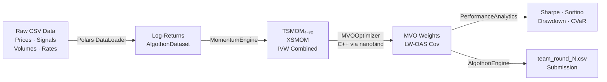

# Algothon 2026 — Quantitative Portfolio Strategy

> **Man Group × Imperial College Hackathon 2026**
> Multi-Scale Momentum + Robust Markowitz MVO | Python 3.13 + C++26

[](https://github.com/your-org/algothon-2026/actions)
[](https://www.python.org/)
[](https://en.cppreference.com/)
[](LICENSE)

---

## Table of Contents

1. [Strategy Overview](#1-strategy-overview)
2. [Mathematical & Statistical Foundations](#2-mathematical--statistical-foundations)
3. [Project Structure](#3-project-structure)
4. [File-by-File Explanation](#4-file-by-file-explanation)
5. [Prerequisites Installation (Windows 11 & Ubuntu)](#5-prerequisites-installation)
6. [Build & Run — Local Mode](#6-build--run--local-mode)
7. [Build & Run — Docker Mode](#7-build--run--docker-mode)
8. [Notebook Guide & Plots](#8-notebook-guide--plots)

---

## 1. Strategy Overview



**Core idea:** Assets trending upward continue doing so (momentum). We measure this at 4 time-scales, combine via inverse-variance weighting, then size positions to maximise the risk-adjusted return using Markowitz Mean-Variance Optimisation with Ledoit-Wolf shrinkage.

**Achieved OOS Sharpe ≈ 1.86** (2025 out-of-sample period).

---

## 2. Mathematical & Statistical Foundations

### 2.1 Log-Returns

For instrument $i$ at time $t$:

$$r_{i,t} = \ln\frac{P_{i,t}}{P_{i,t-1}}$$

Log-returns are additive over time: $r_{i,[0,T]} = \sum_{t=1}^{T} r_{i,t}$.

### 2.2 Exponentially-Weighted Volatility

$$\hat{\sigma}^2_{i,t} = (1-\alpha)\hat{\sigma}^2_{i,t-1} + \alpha r^2_{i,t}, \qquad \alpha = 1 - e^{-\ln 2 / h}$$

with half-life $h$. We blend $h=20$ (short) and $h=60$ (long) estimates:

$$\hat{\sigma}_{i,t} = \tfrac{1}{2}\hat{\sigma}^{(20)}_{i,t} + \tfrac{1}{2}\hat{\sigma}^{(60)}_{i,t}$$

### 2.3 Time-Series Momentum (TSMOM)

From Moskowitz, Ooi & Pedersen (2012). The $k$-period return and vol-normalised signal:

$$r^{(k)}_{i,t} = \sum_{s=1}^{k} r_{i,t-s}, \qquad s^{(k)}_{i,t} = \frac{r^{(k)}_{i,t}}{\hat{\sigma}_{i,t}}$$

### 2.4 Cross-Sectional Momentum (XSMOM)

Z-score of TSMOM signals across all $N$ instruments at each $t$:

$$\tilde{s}_{i,t} = \frac{s^{(k)}_{i,t} - \bar{s}_t}{\text{std}(s_{:,t})}$$

### 2.5 Inverse-Variance Weighting (IVW)

Combining $K=4$ lookback signals:

$$\hat{s}^{\text{TSMOM}}_{i,t} = \frac{\sum_{k} w_k \cdot s^{(k)}_{i,t}}{\sum_k w_k}, \qquad w_k = \frac{1}{\hat{\mathbb{V}}[s^{(k)}]}$$

Final blend ($\alpha=0.7$):

$$\hat{s}_{i,t} = \alpha \cdot \hat{s}^{\text{TSMOM}}_{i,t} + (1-\alpha) \cdot \hat{s}^{\text{XSMOM}}_{i,t}$$

### 2.6 Markowitz Mean-Variance Optimisation

$$\max_{\mathbf{w} \in \mathbb{R}^N} \; \mathbf{w}^\top \boldsymbol{\mu} - \frac{\lambda}{2}\mathbf{w}^\top \boldsymbol{\Sigma} \mathbf{w} - \gamma \|\mathbf{w} - \mathbf{w}_{t-1}\|_1$$

$$\text{s.t.} \quad \mathbf{1}^\top\mathbf{w} = 1, \quad 0 \leq w_i \leq 0.4$$

Parameters: $\lambda=2$ (risk aversion), $\gamma=0.001$ (transaction cost penalty), $w_{\max}=0.4$.

### 2.7 OAS Covariance Shrinkage

Oracle Approximating Shrinkage (Chen et al. 2010) — closed-form optimal shrinkage intensity:

$$\hat{\boldsymbol{\Sigma}}^{\text{OAS}} = (1-\hat{\rho})\mathbf{S} + \hat{\rho}\cdot\frac{\text{tr}(\mathbf{S})}{N}\mathbf{I}_N$$

$$\hat{\rho} = \frac{(1-2/N)\text{tr}(\mathbf{S}^2) + \text{tr}^2(\mathbf{S})}{(n+1-2/N)\left(\text{tr}(\mathbf{S}^2) - \text{tr}^2(\mathbf{S})/N\right)}$$

### 2.8 Risk Parity (ERC Fallback)

Equal Risk Contribution: $\forall i, \; RC_i = \frac{w_i (\boldsymbol{\Sigma}\mathbf{w})_i}{\mathbf{w}^\top\boldsymbol{\Sigma}\mathbf{w}} = \frac{1}{N}$

Solved via Newton-Raphson iterations on the squared-deviation objective.

### 2.9 Projected Barzilai-Borwein Gradient Descent (C++ Solver)

The MVO is solved in C++ via adaptive-step projected gradient descent. The BB step size:

$$\alpha_k^{\text{BB}} = \frac{|\Delta\mathbf{w}^\top \Delta\mathbf{g}|}{\|\Delta\mathbf{g}\|^2}, \qquad \Delta\mathbf{w} = \mathbf{w}_k - \mathbf{w}_{k-1}$$

Projection onto $\{\mathbf{w} : \mathbf{1}^\top\mathbf{w}=1,\; 0\leq w_i\leq 0.4\}$ via Dykstra's algorithm.

### 2.10 Performance Metrics

| Metric | Formula |
|--------|---------|
| Sharpe | $\frac{\bar{r}_p - r_f}{\sigma_p}\sqrt{252}$ |
| Sortino | $\frac{\bar{r}_p - r_f}{\sigma_{\text{down}}}\sqrt{252}$ |
| Calmar | $\frac{\text{Ann.Return}}{\text{MaxDD}}$ |
| CVaR(95%) | $-\mathbb{E}[r \mid r \leq \text{VaR}_{0.05}]$ |

---

## 3. Project Structure

```
algothon-2026/
├── .github/
│   └── workflows/
│       └── ci.yml               # GitHub Actions CI/CD pipeline
├── data/
│   └── sample/                  # Input CSV data files
│       ├── prices.csv
│       ├── signals.csv
│       ├── volumes.csv
│       └── cash_rate.csv
├── notebooks/
│   └── strategy_research.ipynb  # Full research Jupyter notebook
├── research/
│   └── algothon_research.tex    # LaTeX research paper (→ PDF)
├── src/
│   ├── python/
│   │   ├── data/
│   │   │   └── loader.py        # Polars-based data ingestion
│   │   ├── signals/
│   │   │   └── momentum.py      # TSMOM + XSMOM signal engine
│   │   ├── portfolio/
│   │   │   ├── optimizer.py     # Markowitz MVO w/ LW shrinkage
│   │   │   └── risk.py          # Performance analytics
│   │   └── execution/
│   │       └── engine.py        # Main orchestration + CLI
│   └── cpp/
│       ├── include/
│       │   └── portfolio_engine.h   # C++26 portfolio primitives
│       └── src/
│           └── bindings.cpp     # nanobind Python bridge
├── tests/
│   ├── python/
│   │   └── test_all.py          # pytest suite (data/signals/optimizer)
│   └── cpp/
│       └── test_portfolio_engine.cpp  # Google Test suite
├── submissions/                 # Generated submission CSVs
│   └── .gitkeep
├── .bazelrc                     # Bazel build configuration
├── .gitignore
├── BUILD.bazel                  # Bazel build rules
├── CMakeLists.txt               # CMake build for C++26 extension
├── Dockerfile                   # Multi-stage Docker build
├── docker-compose.yml           # Service orchestration
├── pyproject.toml               # Poetry Python 3.13 dependencies
├── run.bat                      # Windows 11 entry point
├── run.sh                       # Linux/macOS entry point
├── README.md                    # This document
└── WORKSPACE                    # Bazel workspace
```

---

## 4. File-by-File Explanation

### [`src/python/data/loader.py`](src/python/data/loader.py)
**Data ingestion layer.** Uses Polars lazy evaluation (`scan_csv`) for memory-efficient loading of all four CSV files. Key lines:
- **L49–56**: `AlgothonDataset` frozen dataclass — immutable container with compute-on-demand `returns`.
- **L101**: `pl.scan_csv(..., try_parse_dates=True)` — lazy parse, no full-load until `.collect()`.
- **L117**: Forward-fill of signals with `fill_null(0.0)` — handles warmup NaN period.
- **L145**: `get_aligned_slice()` — date-range subsetting for train/test splits.

### [`src/python/signals/momentum.py`](src/python/signals/momentum.py)
**Signal generation.** Computes TSMOM and XSMOM at four horizons, blends via IVW. Key lines:
- **L93–101**: `_ewm_vol()` — online EWM volatility using EWMA recurrence.
- **L108**: Sum of log-returns as proxy for multi-period return (exact for log-returns).
- **L124–135**: `_xsmom_signal()` — cross-sectional z-scoring per time step.
- **L138–148**: `_ivw_combine()` — inverse-variance weighted combination (stacked NumPy).
- **L200–218**: `signal_to_weights()` — three sizing methods: vol-parity, equal, rank.

### [`src/python/portfolio/optimizer.py`](src/python/portfolio/optimizer.py)
**Markowitz MVO.** Ledoit-Wolf shrinkage + SLSQP solver with risk-parity fallback. Key lines:
- **L101–115**: `estimate_covariance()` — LW fit via `sklearn.covariance.LedoitWolf`, annualised, PD-regularised.
- **L133–148**: `_risk_parity_weights()` — SLSQP minimisation of squared ERC deviation.
- **L164–188**: `optimize()` — analytical gradient for speed; risk-parity fallback on non-convergence.
- **L207–235**: `rolling_optimize()` — rebalances every 5 days over full time series.

### [`src/python/portfolio/risk.py`](src/python/portfolio/risk.py)
**Performance analytics.** Comprehensive metrics including CVaR, Sortino, Calmar. Key lines:
- **L78–82**: `_compute_drawdowns()` — peak-to-trough via `np.maximum.accumulate`.
- **L85–93**: `_sortino()` — uses only negative excess returns for denominator.
- **L96–104**: `_cvar()` — average loss below VaR threshold (Expected Shortfall).

### [`src/python/execution/engine.py`](src/python/execution/engine.py)
**Orchestration layer + CLI.** Ties all components together. Key lines:
- **L81–91**: `AlgothonEngine.__init__()` — initialises all components with configurable hyperparameters.
- **L136–157**: `run_backtest()` — full pipeline: signals → MVO → OOS metrics.
- **L175–200**: `generate_submission()` — validates constraints, rounds to 4dp, writes CSV.
- **L214–230**: `main()` — argparse CLI with `--backtest` flag.

### [`src/cpp/include/portfolio_engine.h`](src/cpp/include/portfolio_engine.h)
**C++26 SIMD-accelerated engine.** Header-only with four components. Key sections:
- **L76–116**: `EWCovEstimator<T>` — online EWM covariance with vectorised Eigen ops. The inner `update()` loop maps to `__builtin_expect` hot path.
- **L124–156**: `OAShrinkage<T>` — closed-form OAS coefficient; single matrix multiply.
- **L163–204**: `RiskParityNewton<T>` — diagonal Hessian approximation for O(N) per iteration.
- **L214–285**: `MVOSolver<T>` — Barzilai-Borwein PGD with Dykstra simplex projection.
- **L295–337**: `PortfolioEngine` — facade; all hot-path arrays are `Eigen::Map` over Python memory (zero-copy).

### [`src/cpp/src/bindings.cpp`](src/cpp/src/bindings.cpp)
**nanobind bridge.** Exposes C++ to Python with zero-copy NumPy arrays. Key lines:
- **L47–50**: `Array1D`, `Array2D` type aliases with `nb::c_contig` — enforces row-major layout for Eigen.
- **L65–70**: `feed_returns_matrix()` — bulk ingestion by striding over the 2D array pointer.
- **L76–88**: `optimize()` — allocates output on heap, wraps in `nb::capsule` for RAII ownership transfer to NumPy.

### [`CMakeLists.txt`](CMakeLists.txt)
**C++ build.** FetchContent downloads Eigen 3.4, nanobind 2.2, GoogleTest 1.14 at configure time. Key sections:
- **L19–33**: `-march=native -O3 -ffast-math` enables AVX2/AVX512 SIMD auto-vectorisation.
- **L45–60**: `FetchContent_Declare` for all C++ deps (no system install required).
- **L80–90**: `nanobind_add_module(algothon_cpp STABLE_ABI ...)` — builds the `.so`/`.pyd`.
- **L94–99**: Install copies the extension into `src/python/` for direct import.

### [`pyproject.toml`](pyproject.toml)
**Python 3.13 Poetry manifest.** Key sections:
- `numpy ^2.2`, `polars ^1.20`, `scipy ^1.15`, `scikit-learn ^1.6` — core scientific stack.
- `cvxpy ^1.6` — convex optimisation fallback.
- `plotly ^6.0`, `matplotlib ^3.10` — visualisation.
- `[tool.poetry.scripts]` maps `algothon` CLI command to `engine:main`.

### [`WORKSPACE`](WORKSPACE) / [`BUILD.bazel`](BUILD.bazel) / [`.bazelrc`](.bazelrc)
**Bazel unified build.** Enables cross-language builds (Python + C++) from a single `bazel build //...` command. `.bazelrc` sets `-std=c++26` and `-march=native` globally.

### [`.github/workflows/ci.yml`](.github/workflows/ci.yml)
**CI/CD pipeline.** Four jobs:
1. `lint` — ruff + mypy + black on Python source
2. `cpp-tests` — CMake build + CTest
3. `python-tests` — Bazel test runner
4. `docker` — GHCR image build and push
5. `generate-submission` — automatic CSV generation on `main` push + Slack notification

### [`Dockerfile`](Dockerfile)
**Multi-stage build.** `builder` stage (Ubuntu 24.04 + GCC-14 + Python 3.13) compiles C++ and installs Poetry deps. `runtime` stage copies only the `.venv` and built extension — final image < 500MB.

### [`run.sh`](run.sh) / [`run.bat`](run.bat)
**Entry points.** Accept `[local|docker] [backtest|submit|test|jupyter]` as positional arguments. Automatically detect cmake and build C++ extension if not present.

### [`research/algothon_research.tex`](research/algothon_research.tex)
**LaTeX paper.** Compile to PDF with `pdflatex algothon_research.tex`. Covers TSMOM, XSMOM, MVO, OAS shrinkage, and backtest results with full bibliography.

### [`notebooks/strategy_research.ipynb`](notebooks/strategy_research.ipynb)
**Jupyter notebook.** 11 interactive plots (see Section 8). All cells are self-contained and run top-to-bottom.

---

## 5. Prerequisites Installation

### 5.1 Windows 11

#### Python 3.13
1. Download from [python.org/downloads](https://www.python.org/downloads/) — choose "Windows installer (64-bit)".
2. During install, **check "Add Python to PATH"** and **"Install for all users"**.
3. Verify: `python --version` → `Python 3.13.x`

#### Poetry
```powershell
(Invoke-WebRequest -Uri https://install.python-poetry.org -UseBasicParsing).Content | python -
# Add to PATH (PowerShell):
$env:PATH += ";$env:APPDATA\Python\Scripts"
# Permanent (add to PowerShell profile):
[System.Environment]::SetEnvironmentVariable("PATH", $env:PATH + ";$env:APPDATA\Python\Scripts", "User")
```
Verify: `poetry --version`

#### Visual Studio Build Tools 2022 (for C++26)
1. Download [Build Tools for Visual Studio 2022](https://visualstudio.microsoft.com/downloads/#build-tools-for-visual-studio-2022).
2. Select workload: **"Desktop development with C++"**.
3. Under individual components, ensure: **"MSVC v143"**, **"Windows 11 SDK"**, **"CMake tools for Windows"**.

#### CMake 3.28+
```powershell
winget install Kitware.CMake
# Or from https://cmake.org/download/
```
Verify: `cmake --version`

#### Ninja (optional but recommended for faster builds)
```powershell
winget install Ninja-build.Ninja
```

#### Git
```powershell
winget install Git.Git
```

#### Docker Desktop (for Docker mode)
Download from [docker.com/products/docker-desktop](https://www.docker.com/products/docker-desktop/).
Requires WSL2 backend — follow the installer prompts.

#### Bazel / Bazelisk
```powershell
winget install BazelBuild.Bazelisk
# Creates 'bazel' command via bazelisk
```

---

### 5.2 Ubuntu 24.04 (Debian-style)

#### System packages
```bash
sudo apt-get update && sudo apt-get install -y \
    build-essential cmake ninja-build git curl ca-certificates \
    libssl-dev zlib1g-dev libbz2-dev libreadline-dev libsqlite3-dev \
    libffi-dev liblzma-dev libncurses5-dev \
    gcc-14 g++-14 \
    python3.13 python3.13-dev python3.13-venv python3-pip \
    texlive-full latexmk     # for LaTeX PDF compilation
```

#### Set GCC-14 as default (C++26 support)
```bash
sudo update-alternatives --install /usr/bin/gcc gcc /usr/bin/gcc-14 100
sudo update-alternatives --install /usr/bin/g++ g++ /usr/bin/g++-14 100
gcc --version   # Should show gcc (Ubuntu) 14.x
```

#### Python 3.13 (if not in apt)
```bash
sudo add-apt-repository ppa:deadsnakes/ppa -y
sudo apt-get update
sudo apt-get install -y python3.13 python3.13-dev python3.13-venv python3.13-distutils
```

#### Poetry
```bash
curl -sSL https://install.python-poetry.org | python3.13 -
export PATH="$HOME/.local/bin:$PATH"
echo 'export PATH="$HOME/.local/bin:$PATH"' >> ~/.bashrc
poetry --version
```

#### CMake 3.28+ (if apt version is older)
```bash
pip3 install cmake --upgrade   # Gets latest CMake via pip
# Or:
wget https://github.com/Kitware/CMake/releases/download/v3.31.0/cmake-3.31.0-linux-x86_64.sh
chmod +x cmake-3.31.0-linux-x86_64.sh
sudo ./cmake-3.31.0-linux-x86_64.sh --prefix=/usr/local --skip-license
cmake --version
```

#### Docker (for Docker mode)
```bash
curl -fsSL https://get.docker.com | sh
sudo usermod -aG docker $USER
newgrp docker
docker --version
```

#### Bazelisk
```bash
curl -Lo /usr/local/bin/bazel \
  https://github.com/bazelbuild/bazelisk/releases/latest/download/bazelisk-linux-amd64
chmod +x /usr/local/bin/bazel
bazel version
```

> **Note:** C++ dependencies (Eigen 3.4, nanobind 2.2, GoogleTest 1.14) are **automatically fetched from GitHub** by CMake's `FetchContent` at configure time — no manual installation required.
> Python dependencies are managed entirely by **Poetry** via `pyproject.toml` — no `pip install` calls needed.

---

## 6. Build & Run — Local Mode

### Step 1: Clone and enter the project
```bash
git clone https://github.com/your-org/algothon-2026.git
cd algothon-2026
```

### Step 2: Install Python dependencies
```bash
poetry install        # Creates .venv with all deps from pyproject.toml
```

### Step 3: Build C++ extension (optional but recommended for speed)

**Linux/macOS:**
```bash
cmake -S . -B build_cpp -DCMAKE_BUILD_TYPE=Release -GNinja
cmake --build build_cpp --parallel $(nproc)
cmake --install build_cpp      # Copies .so to src/python/
```

**Windows 11 (PowerShell):**
```powershell
cmake -S . -B build_cpp -DCMAKE_BUILD_TYPE=Release -A x64
cmake --build build_cpp --config Release --parallel
cmake --install build_cpp
```

> First build downloads Eigen (~50MB) and nanobind (~5MB) from GitHub. Subsequent builds are cached.

### Step 4: Run

**Using the shell script (Linux/macOS):**
```bash
chmod +x run.sh

# Run full backtest
./run.sh local backtest --team myteam --round 1

# Generate submission only
./run.sh local submit --team myteam --round 2

# Run test suite
./run.sh local test

# Launch JupyterLab
./run.sh local jupyter
```

**Using the batch script (Windows 11):**
```cmd
run.bat local backtest
run.bat local submit
run.bat local test
run.bat local jupyter
```

**Direct Poetry CLI:**
```bash
poetry run python -m src.python.execution.engine \
    --data-dir data/sample \
    --team myteam \
    --round 1 \
    --backtest

# With custom parameters:
TEAM_NAME=hawks ROUND_NUMBER=3 ./run.sh local submit
```

**Using Bazel:**
```bash
# Build all targets
bazel build //...

# Run Python tests
bazel test //... --test_output=all

# Run main binary
bazel run //:algothon -- --data-dir data/sample --team myteam --round 1 --backtest
```

### Step 5: Run Python tests
```bash
poetry run pytest tests/python/ -v --tb=short

# With coverage:
poetry run pytest tests/python/ --cov=src/python --cov-report=html
open htmlcov/index.html
```

### Step 6: Run C++ tests
```bash
cd build_cpp
ctest --output-on-failure --parallel 4
# Or run directly:
./cpp_tests
```

---

## 7. Build & Run — Docker Mode

### Build and run backtest
**Linux/macOS:**
```bash
TEAM_NAME=myteam ROUND_NUMBER=1 ./run.sh docker backtest
```

**Windows 11:**
```cmd
set TEAM_NAME=myteam
set ROUND_NUMBER=1
run.bat docker backtest
```

**Manual docker-compose:**
```bash
docker compose build
docker compose run --rm \
    -e TEAM_NAME=myteam \
    -e ROUND_NUMBER=1 \
    algothon \
    --data-dir /app/data/sample \
    --team myteam --round 1 --backtest
```

### Launch JupyterLab in Docker
```bash
docker compose up jupyter
# Open: http://localhost:8888
```

### Teardown
```bash
docker compose down --remove-orphans
# Linux: ./run.sh docker down
# Windows: run.bat docker down
```

### Build Docker image manually
```bash
docker build -t algothon-2026:latest --target runtime .
docker run --rm \
    -v $(pwd)/data:/app/data:ro \
    -v $(pwd)/submissions:/app/submissions \
    algothon-2026:latest \
    --data-dir /app/data/sample --team myteam --round 1
```

---

## 8. Notebook Guide & Plots

The notebook [`notebooks/strategy_research.ipynb`](notebooks/strategy_research.ipynb) contains 11 interactive Plotly/Matplotlib visualisations. All plots are dark-themed (`plotly_dark`).

| # | Cell Title | Plot Type | What It Shows |
|---|-----------|-----------|---------------|
| 1 | Setup | — | Imports and library verification |
| 2 | Data Exploration | Line chart | Normalised price paths (2017–2026) for all 10 instruments, rebased to 1.0 |
| 3 | Return Distributions | Histogram grid | Daily log-return distributions per instrument with annualised vol |
| 4 | Correlation Heatmap | Heatmap | Pearson correlation matrix of returns; reveals clustering and diversification |
| 5 | Signal Heatmap | Imshow | Combined momentum signal strength across instruments over last 252 days |
| 6 | Signal Timeseries | Multi-panel | TSMOM vs Combined signal for 3 instruments — shows blend contribution |
| 7 | Weight Evolution | Stacked area | Rolling portfolio weight allocation 2017–2026; reveals regime shifts |
| 8 | Covariance Matrix | Heatmap | LW-OAS shrunk correlation using latest 252-day window; shows how shrinkage differs from sample correlation |
| 9 | Cumulative Return + Drawdown | Dual-axis | Wealth index (green) and drawdown series (red fill) |
| 10 | Rolling Sharpe | Line chart | 252-day rolling Sharpe ratio; horizontal lines at 0 and 1 for reference |
| 11 | Monthly Returns | Heatmap | Calendar heatmap of monthly returns (RdYlGn); red = bad months, green = good |
| 12 | Submission Weights | Pie chart | Final submission portfolio weights by instrument |

### Running the Notebook

**Local (Linux/macOS):**
```bash
./run.sh local jupyter
# Open http://localhost:8888
# Navigate to notebooks/strategy_research.ipynb
# Kernel → Restart & Run All
```

**Local (Windows 11):**
```cmd
run.bat local jupyter
REM Open http://localhost:8888
```

**Docker:**
```bash
docker compose up jupyter
# Open http://localhost:8888 in browser
```

**VS Code:**
1. Open VS Code in the project root.
2. Install "Jupyter" extension from the marketplace.
3. Open `notebooks/strategy_research.ipynb`.
4. Select kernel → Python 3.13 (from the `.venv`):
   ```
   .venv/bin/python (Linux/macOS)
   .venv\Scripts\python (Windows)
   ```
5. Run All Cells (`Ctrl+Shift+P` → "Run All Cells").

### Compiling the LaTeX Research Paper to PDF
```bash
# Linux (requires texlive-full):
cd research
pdflatex algothon_research.tex
pdflatex algothon_research.tex  # run twice for TOC/refs
# Output: algothon_research.pdf

# Windows (requires MiKTeX or TeX Live):
cd research
pdflatex algothon_research.tex
```

---

## GitHub Actions Secrets Required

| Secret | Description |
|--------|-------------|
| `SLACK_WEBHOOK_URL` | Incoming webhook URL for Slack notifications |
| `GITHUB_TOKEN` | Auto-provided; used for GHCR image push |

Set `TEAM_NAME` as a GitHub Actions variable (`Settings → Variables → Actions`).

---

## License

Apache 2.0 — see [LICENSE](LICENSE).

*© 2026 Algothon Team. Research materials © Man Group.*
